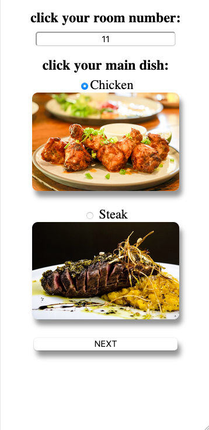

ROOM SERVICE AT A HOTEL
For project 2 at my  SEI Bootcamp, I've been asked to build an app based on a database.
I have a friend that manages a hotel. I've asked him if he needs anything because I wanted to experience some "real" requirements.
My friend told me that during the covid, their dining room is close, and the room service dinner. Each customer has to fill a form, and it is a mess to deliver the information to the chef.
So I said to myself, I am going to solve this problem.

I dealt with two collections in my database: 
Room's data - room number, how many people, Last name.
Orders data- main dish, side, dessert,  and allergies or comments for the chef.
I reference the collections and give the customer the ability to order his dinner and edit it.
For the managing side, In the end, I created a list with all the data for the chef.

Screenshot:

Technologies Used:
MongoDB, mongoose, Node, Express, js, CSS, HTML

Getting Started:
 Heroku link: https://hotel-room-service.herokuapp.com/
github link:
Trello:  my trllo https://trello.com/b/di8TJFN9/planing-user-flow

Next Steps:
Add more dishes, like veggies and drinks.
Make a QR code for identification.
Make the code "DRY".
Improve the CSS

 
I'll be happy to read your thoughts. 
Thank you very much.

Orit Leshem

credit for pictures:
Chicken picture : Image by Laddawan Somkaew  from Pixabay 

Potato picture: Image by Christo Anestev from Pixabay 

Rice picture: Image by Seb Powen from Pixabay 

Chocolate cake: Image by Kevin Petit from Pixabay 

Eclair picture: Image by RitaE from Pixabay 

Beef picture: Image by Diana Yanes from Pixabay 

 Giph: https://imgur.com/gallery/ok65CYj